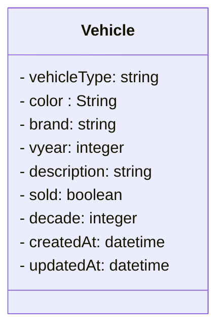

# Vehicle Registry
## Principais Tecnologias
- **Java 17**
- **Spring Boot 3**
- **Spring Data JPA**
- **Spring boot validation**
- **Mysql**
-  **Docker**

Este projeto tem como objetivo desenvolver uma API RESTful para o cadastro e gerenciamento de veículos. A API permite realizar operações de criação, consulta, atualização e exclusão de registros, além de fornecer consultas personalizadas com base no ano de fabricação e na marca dos veículos. O projeto possui cobertura de testes e fornece tratamento de erros envolvendo mensagens amigaveis para quem consome a api.

Vehicle:

    Atributos: Veiculo, marca, ano, descricao, vendido, cadastro, atualização.

## Endpoints
 - **GET /veiculos**
- **GET /veiculos?marca={marca}&ano={ano}&cor={cor}**
- **GET /veiculos/not-sold**
- **GET /veiculos/by-last-week**
- **GET /veiculos/by-decade**
- **GET /veiculos/by-brand**
- **GET /veiculos/{id}**
- **POST /veiculos**
- **PUT /veiculos/{id}**
- **PATCH /veiculos/{id}**
- **DELETE /veiculos/{id}**

## Funcionalidades do Sistema
- Cadastro completo de veículos com operações CRUD (Criar, Listar, Atualizar e Deletar)
- Exibir quantos veiculos estão como não vendidos
- Exibir veiculos por decada de fabricação
- Exibir veiculos pela marca
- Exibir veiculos que foram cadastrados dentro de uma semana
- Persistência dos dados em banco de dados MySQL
- Endpoints personalizados para:
  - Contar veículos por ano de fabricação
  - Contar veículos por marca
  - Contar veículos cadastrados dentro de um intervalo de datas

## Considerações finais
- A collection do postman está disponibilizada na raiz desse projeto no arquivo chamado: geren_veiculos.postman_collection.json
- Foram adicionados testes de integração, além dos testes unitários, e customizadas anotações para validar casos específicos

